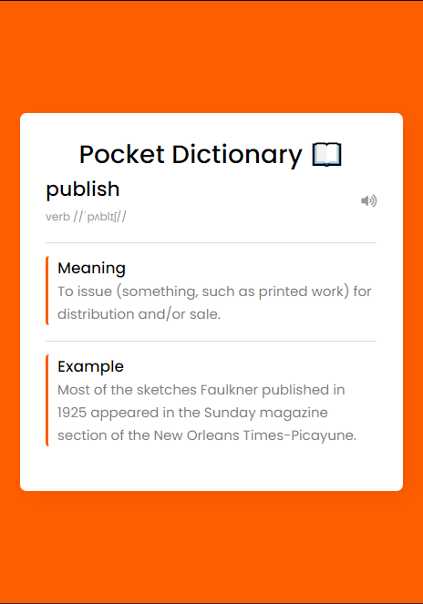

# PocketDictionary

## 📝 About
Pocket Dictionary is a Chrome Extension for English definitions, synonyms, audio pronunciations and example sentences of selected words.

## 🐞 Brief History of Development

## 👩‍🏫 Installing PocketDictionary

1. Clone this repo
2. Open up Chrome/Brave Browser and go to the extensions page
3. Enable developer mode 
4. Click on “Load unpacked extension…”
5. Select the folder for this app
-Will be uploaded to extensions market.-

## 🚀 Running PocketDictionary

1.Highlight the text that you'd like to learn more informatins about then right click.  
2.Click the PocketDictionary: "{word}" button in context menu.  
-Voila.

## 📸 Screenshots

