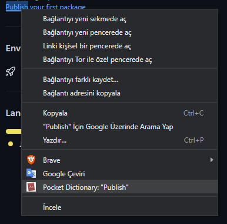

# PocketDictionary
Pocket Dictionary is a Chrome Extension for English definitions, synonyms, audio pronunciations and example sentences of selected words.

## To Install

1. Clone this repo
2. Open up Chrome/Brave Browser and go to the extensions page
3. Enable developer mode 
4. Click on “Load unpacked extension…”
5. Select the folder for this app

## Screenshots

## How-To

-Highlight the text that you'd like to learn more informatins about then right click.
-Click the PocketDictionary: "{word}" button in context menu.
-Voila.
